# Task Manager API

## Table of Contents
- [About](#about)
- [System Architecture](#system-architecture)
  - [REST API](#rest-api)
    - [To create an account](#to-create-an-account)
    - [To log in](#to-log-in)
  - [Creating a Docker Image](#Creating-a-Docker-Image)


## About 


## System Architecture


## REST API 
This REST API serves as a simple way to create and manage tasks across teams of users. It facilitates the creation, reading, updating and deletion of tasks and users with hash-based authentication and admin permissions.

The technology stack used to create this API includes a Cloud SQL database (GCP), Python and Docker.

Use the following URL API path:

## To create an account:

`<POST>` /create/user
  
JSON body:
```
{"user_fname": "John", 
"user_lname": "Smith", 
"username": "Jonno", 
"user_password": "password123", 
"user_email": "john.smith@gmail.com"}
```
## To log in:

`<POST>` /login

JSON body:
```
{"user_email": "john.smith@gmail.com",
"user_password": "password123"}
```

This will return a private key (e.g. “72763aed849210fg93gh39210d”) that you must include in the body of all requests to verify your access to resources.

You will now have access to the following services specific to your account:

**To Create a task**

`<POST>` /create/task

body parameters: 
```
username, user_api_key, task_title, task_description
```
**To Read all tasks**

`<POST>` /view/tasks 

body parameters: 
```
username, user_api_key
```

**To Read a task**

`<POST>` /view/task/<task_id>

body parameters: 
```
username, user_api_key
```

**To Update a task**

`<PUT>` /update/task/<task_id>

body parameters: 
```
username, user_api_key, [task_title, task_description, task_status])
```

**To Delete a task**

`<DELETE>` /delete/task/<task_id> 

body parameters:
```
username, user_api_key
```

**To Read all users**

`<POST>` /view/users 

body parameters: 
```
username, user_api_key
```
(permissions: admin only)

**To Read a user**
`<POST>` /view/user/<username>
  
body parameters:
```
username, user_api_key
```
(permissions: admin only)
  
**To Delete a user**

`<DELETE>` /delete/user/<username> 
  
parameters: 
```
username, user_api_key) 
```
(permissions: admin only)

If any confusion arises, please inspect and follow the guidance in the error messages returned by the REST API.


#### -----------------------------------------------------------------------

<br><br>
## Creating the Docker Image
  
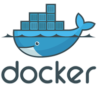   

We are gonna be walking us through how we created a docker container for our flask application and then deployed it on the Google Cloud run. 

The first thing we did was we created a Docker file. 

This Docker file is very basic. 
 
There's nothing new and once this file is created we actually went ahead and built our container. 

```
FROM python:3.7-alpine
WORKDIR /dockerimage
COPY . /dockerimage
RUN pip install -r requirements.txt
EXPOSE 80
CMD ["python", "main.py"]
``` 
  
So to do that we used the Docker build command prompt, write it right, OK, tag it. With a specific name. Press 2 dash docker. 

``` 
docker build . --tag-europe-west2-docker.pkg.dev/
``` 

So this needs to be the stack needs to be in a specific name because I want to. Once I've built this image, I want to push it to Google's artifact registry directly using Docker push. To do that I need to make sure that the tag or name of the image is in a specific format.  That specific format is the location of my artifact registry, which is europe-west2-docker.pkg.dev. 
  

Then it needs to have the the project name for our project in our Google account, it's going to be cloud computing Flask app. deployment under score, GCP, and we are gonna tag it with the version name. So I've already uploaded versions 123 and four so I'm gonna push this as the version 5.
  
``` 
docker build . --tag-europe-west2-docker.pkg.dev/cloudcomputingapp-346212/flaskapp/cloudflaskappdeployment_gcp:v5
``` 
And we're going run this and it's gonna take a couple of seconds to run and create our image file. 

Once the image file is created, we can just go and push it onto our artifact registry on Google.  For that we need to use the Docker push command followed by the name of the registry, the name of the registry and repository where I want to push our container. 
  

It's gonna be:

``` 
docker push europe-west2-docker.pkg.dev/cloudcomputingapp-346212/flaskapp/cloudflaskappdeployment_gcp:v5  
```   
  
So the thing to note here is that there's been no change between versions 3-4 and five that I've uploaded, so it said that this this file, or this container already exists, so it you know it just retagged. It didn't put it again. 
  
You can actually go to your cloud Google console.  Let us go to our console. 

``` 
cloud.google.com
``` 
 
And from our console we are going to go to the artifact registry by typing artifact registry in the search box at the top of the page which is basically the container registry on Google
  
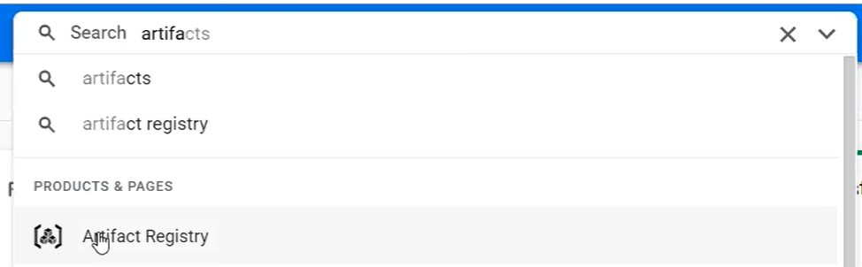  
  
We can see there's a flask app repository already available here and it is in. 
  
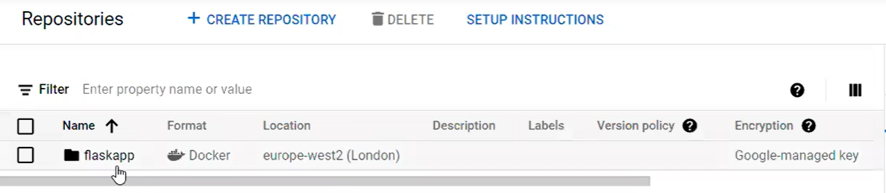 
  
It is in a Docker format and it is deployed in Europe-West2, which is their London based data center.
  
You can open it.  
  
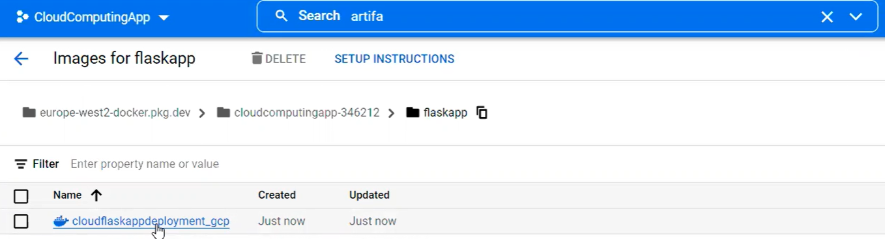 

You can see that we just pushed in cloudflaskappdeployment_gcp so open it. 
  
 
  
You can see that there's a the container there, just deployed V5. 
It's stacked as version five, so you know it was created one minute ago, and now you can go to cloud down and import, this can go to cloud run.
  
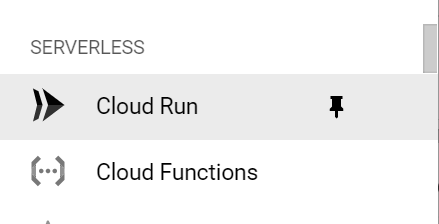 

If you want to create a new service, you can go to create a service.
  
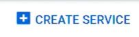 
  
I need to show or tell it where to get the container from so I'm gonna click on select. 
My containers was stored in the artifact industry, so I'm going to go here. 

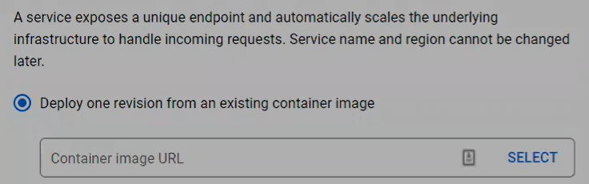 

This is the repository I want to upload. 

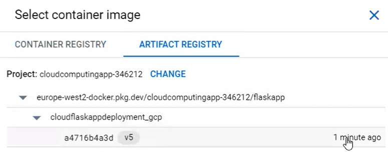 

This is the repository I want to upload so Select this. 
I want to deploy this in London, so I'm gonna go and select.
  
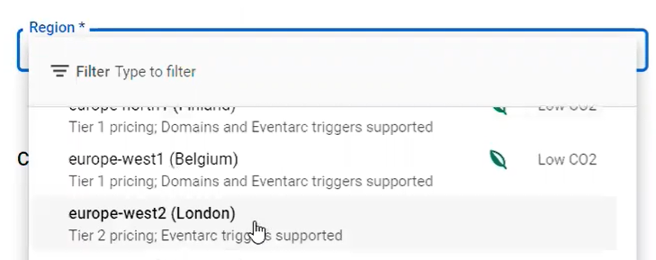 

You only want the CPU to be allocated during request processing. 
You don't want the CPU to be always be allocated because it's gonna cost you more. You want to disable Autoscaling so you just want to have one instance, minimum one instance maximum. 

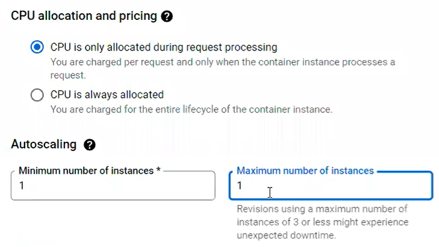   
  
I want to allow all traffic because this container should be accessible from everywhere. 
I don't want to have any. 
  
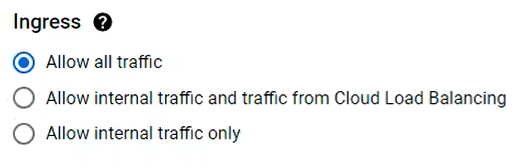
  
Google's authentication systems you are going to allow all unauthenticated notifications as well.  
  
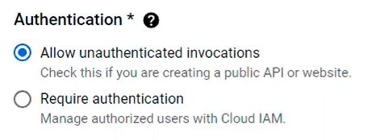

And then I need to go and change a few more changes here. I need to change this container board to 5000 because this is a class camp. Last lessons to 5000, so I need to tell my container that any request you get on port 80 needs to be forwarded to port 5000. 

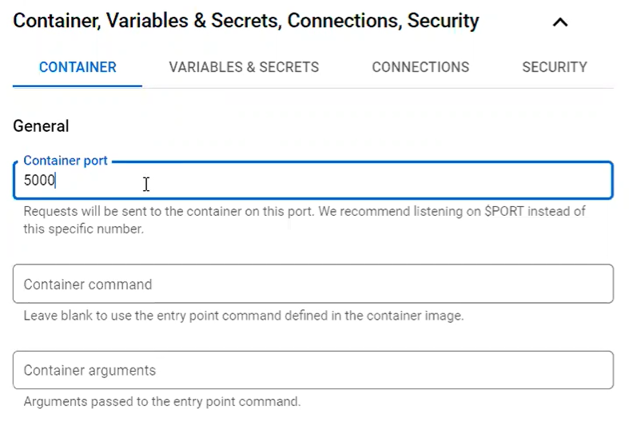

I'm going to reduce the memory capacity because I don't need 512MB.  I'm gonna skip one CPU. 

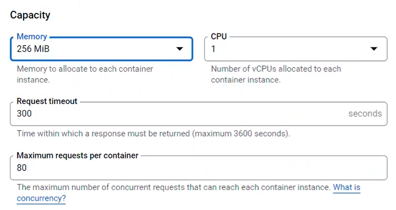
  
And I'm going to leave everything as default just and then go and create my container. 
  
So contain creating the container takes a bit of time, but now that it's done I have the the URL. 

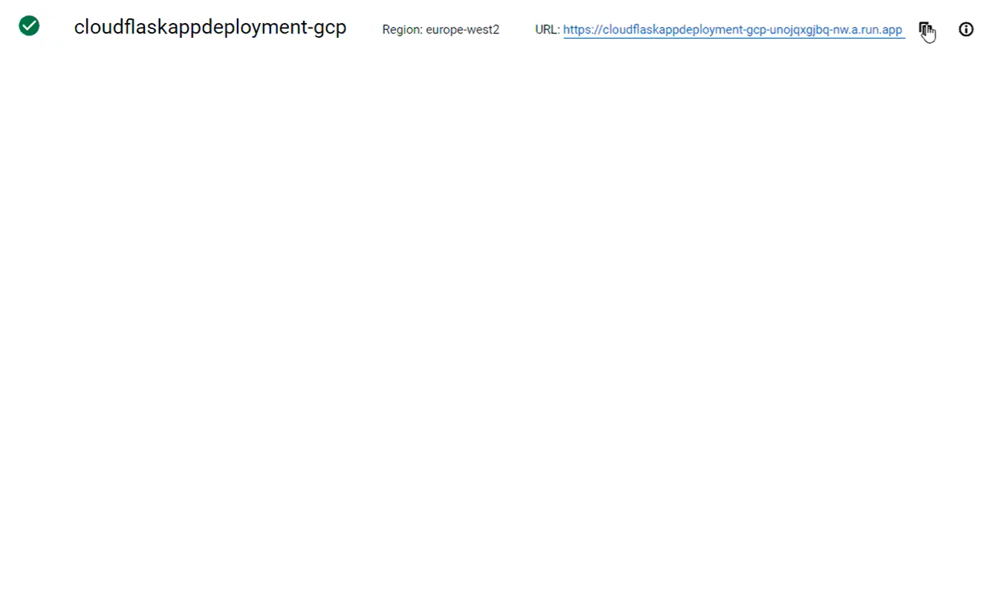
  
Here you can just copy it and then use it on any postman application I have and then it's going to work with mine and that's how we went ahead and created our or deployed our task app on to Google's cloud platform. 
  
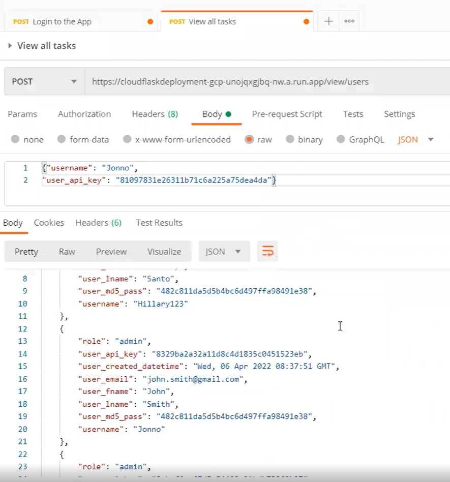
  
  
#### -----------------------------------------------------------------------
  
  

  
  
<br><br>
##### Creating the Docker Image
<p align="left">
  
</p>
Create our docker image with the "Dockerfile" from our repository by:

```
docker build -t gcr.io/${USER_ID}/tasks:v1 .
```

List your Docker images to verify.
```
docker images
```


#### Docker Container
<p align="left">
  
</p>

1. Install [Docker](https://docs.docker.com/get-docker/) and verify your installation with ``` docker -v ```
2. Launch the terminal in the library_api folder or direct to this directory.
3. Build the docker image (be sure to include the ". " at the end and to define your username ``` whoami```)

```
docker build -t <your username>/tasks . 
```

4. Run your container:
```
docker run -it -p 5000:5000 <your username>/tasks 
```

This will map port 5000 to the host 5000 in our container. 

5. Access the backend from your browser via ``http://localhost:5000``

More info: [Dockerizing a Node.js web app](https://nodejs.org/en/docs/guides/nodejs-docker-webapp/) 

