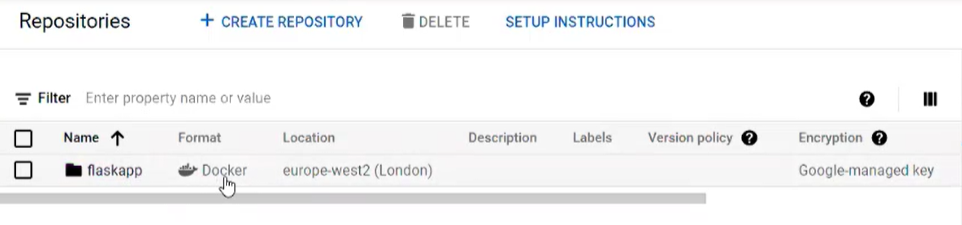

# Task Manager API

## Table of Contents
- [About](#about)
- [System Architecture](#system-architecture)
  - [Database Setup](#database-setup)
  - [REST API](#rest-api)
    - [To create an account](#to-create-an-account)
    - [To log in](#to-log-in)
    - [CRUD functions](#crud-functions)
  - [Creating a Docker Image](#creating-a-docker-image)
  - [Authentication](#Authentication)
  - [Conclusion](#conclusion)
  - [YouTube Video](#youtube-video)
  - [Disclaimer](#disclaimer)

## About 

Welcome to our group project, the Task Manager API and we are going to write about our own cloud computing project using the Flask, Python and database cloud computing in VM instances.

The project we chose was to build a task Manager API application where users can track their tasks that they have been assigned for the day and then a user and a user side as well, so there's usual authentication in our team.

## System Architecture

The system is mostly involved on the database and also authentication that worked with the Flask, API and VM instance setup as well as the Docker image.

We are going to write about the cloud, Google Cloud, SQL database, the architecture of the system, how it connects between the Google Cloud VM instance and the Google Cloud database.

We also write about the CRUD applications that we used, so some of our tasks, so adding tasks, leading tasks, those sort of crud features, and then as well how we deployed the application onto the Google Cloud VM instance and how it's using a Docker image so it's available through endpoint calls.

## Database Setup 
We used the following commands to create the database in GCP:

```
CREATE TABLE tbl_users ( 
username VARCHAR(255) NOT NULL, 
user_fname VARCHAR(255) DEFAULT NULL, 
user_lname VARCHAR(255) DEFAULT NULL, 
user_email VARCHAR(255) DEFAULT NULL, 
user_md5_pass VARCHAR(255) DEFAULT NULL, 
user_api_key VARCHAR(255) DEFAULT NULL, 
user_created_datetime datetime DEFAULT NULL,
PRIMARY KEY(username)
) ENGINE=InnoDB DEFAULT CHARSET=utf8mb4;


CREATE TABLE tbl_tasks ( 
task_id INT NOT NULL AUTO_INCREMENT,
username VARCHAR(255) DEFAULT NULL, 
user_api_key VARCHAR(255) NOT NULL, 
task_title VARCHAR(255) DEFAULT NULL, 
task_description TEXT DEFAULT NULL, 
task_status INT NOT NULL DEFAULT 0, 
task_created_datetime datetime NOT NULL, 
task_updated_datetime datetime NOT NULL,
PRIMARY KEY(task_id),
FOREIGN KEY(username) REFERENCES tbl_users(username)
) ENGINE=InnoDB DEFAULT CHARSET=utf8mb4; 
```
We created some dummy data to initially add to the database so we could test the GET commands:

```
INSERT INTO tbl_users (username, user_fname, user_lname, user_email, user_md5_pass, user_api_key, user_created_datetime) VALUES ('john.test','john', 'test', 'john_test@email.com', '81dc9bdb52d04dc20036dbd8313ed055', 'pWJn2HDoN4', NOW()); 


INSERT INTO tbl_tasks (username, user_api_key, task_title, task_description, task_created_datetime, task_updated_datetime) 
VALUES ('ghop','pWJn2HDoN4','Complete Cloud Computing CW','Got to do big things!',NOW(),NOW());

INSERT INTO tbl_tasks (user_id, user_api_key, task_title, task_description, task_status, task_created_datetime, task_updated_datetime) 
VALUES (2,'pWJn2HDoN4','Create our Project Video','Got to do big things!',0,NOW(),NOW());
```

Finally using the GCP UI we were able to configure the database and setup the connection details:

```
#app.yaml
runtime: python37

env_variables:
  CLOUD_SQL_USERNAME: root
  CLOUD_SQL_PASSWORD: cloudcomputingtasks
  CLOUD_SQL_DATABASE_NAME: cloudcomputingtask
  CLOUD_SQL_CONNECTION_NAME: cloudcomputingcw-343618:europe-west2:cloudcomputingtasks
```

## REST API 
This REST API serves as a simple way to create and manage tasks across teams of users. It facilitates the creation, reading, updating and deletion of tasks and users with hash-based authentication and admin permissions.

The technology stack used to create this API includes a Cloud SQL database (GCP), Python and Docker.

We have made a collection of all the APIs that are working on postman. You just need to change the endpoint from our localhost (127.0.0.1) to the GCP URL.

Use the following URL API path:
https://www.getpostman.com/collections/9ab1b3503ce1c60fa924

## To create an account:

`<POST>` /create/user
  
JSON body:
```
{"user_fname": "John", 
"user_lname": "Smith", 
"username": "Jonno", 
"user_password": "password123", 
"user_email": "john.smith@gmail.com"}
```
## To log in:

`<POST>` /login

JSON body:
```
{"user_email": "john.smith@gmail.com",
"user_password": "password123"}
```

This will return a private key (e.g. “72763aed849210fg93gh39210d”) that you must include in the body of all requests to verify your access to resources.

You will now have access to the following services specific to your account:

## CRUD functions:

**To Create a task**

`<POST>` /create/task

body parameters: 
```
username, user_api_key, task_title, task_description
```
**To Read all tasks**

`<POST>` /view/tasks 

body parameters: 
```
username, user_api_key
```

**To Read a task**

`<POST>` /view/task/<task_id>

body parameters: 
```
username, user_api_key
```

**To Update a task**

`<PUT>` /update/task/<task_id>

body parameters: 
```
username, user_api_key, [task_title, task_description, task_status])
```

**To Delete a task**

`<DELETE>` /delete/task/<task_id> 

body parameters:
```
username, user_api_key
```

**To Read all users**

`<POST>` /view/users 

body parameters: 
```
username, user_api_key
```
(permissions: admin only)

**To Read a user**

`<POST>` /view/user/<username>
  
body parameters:
```
username, user_api_key
```
(permissions: admin only)

**To Delete a user**
  
`<DELETE>` /delete/user/<username> 
  
parameters: 
```
username, user_api_key) 
```
(permissions: admin only)

If any confusion arises, please inspect and follow the guidance in the error messages returned by the REST API.

## Creating a Docker Image
  
   

We are going to walk through how we created a docker container for our flask application and then deployed it on the Google Cloud run. 

The first thing we did was we created a Docker file.  This Docker file is very basic. 
 
There's nothing new and once this file is created, we actually went ahead and built our container. 

```
FROM python:3.7-alpine
WORKDIR /dockerimage
COPY . /dockerimage
RUN pip install -r requirements.txt
EXPOSE 80
CMD ["python", "main.py"]
``` 
  
So, to do that we used the Docker build command prompt, type below with a specific name 

``` 
docker build . --tag-europe-west2-docker.pkg.dev/
``` 

So, this needs to be in a specific name because once have built this image, you want to push it to Google's artifact registry directly using Docker push. To do that you need to make sure that the tag or name of the image is in a specific format.  That specific format is the location of our artifact registry, which is europe-west2-docker.pkg.dev. 

Then it needs to have the project name for our project in our Google account, it's going to be cloudcomputingapp-346212/flaskapp/cloudflaskappdeployment_gcp:v5, with the version name to version 5 as we have already uploaded versions 123 and 4.
  
``` 
docker build . --tag-europe-west2-docker.pkg.dev/cloudcomputingapp-346212/flaskapp/cloudflaskappdeployment_gcp:v5
``` 
And we're going run this and it's going to take a couple of seconds to run and create our image file. 

Once the image file is created, we can just go and push it onto our artifact registry on Google.  For that we need to use the Docker push command followed by the name of the registry, the name of the registry and repository where we want to push our container. 
  
It's going to be:

``` 
docker push europe-west2-docker.pkg.dev/cloudcomputingapp-346212/flaskapp/cloudflaskappdeployment_gcp:v5  
```   
  
So, the thing to note here is that there's been no change between versions 3-4 and 5 that we have uploaded, so this container already exists, so it you know it just retagged and it didn't put it again. 
  
You can actually go to your cloud Google console.  Let us go to our console. 

``` 
cloud.google.com
``` 
 
From our console we are going to go to the artifact registry by typing artifact registry in the search box at the top of the page which is basically the container registry on Google
  
  
  
We can see there's a flask app repository already available here. 
  
 
  
It is in a Docker format, and it is deployed in Europe-West2, which is their London based data centre, so you click on it.  
  
 

You can see that we just pushed in cloudflaskappdeployment_gcp so click on it. 
  
 
  
You can see that there's a container there, just deployed V5. 
It's stacked as version five, so you know it was created one minute ago, and now we can go to cloud down and import, this can go to cloud run.
  
 

If you want to create a new service, you can go to create a service.
  
 
  
We need to show or tell you where to get the container from so we are going to click on select it.  My containers were stored in the artifact industry, so we are going to go here. 

 

This is the repository we want to upload. 

 

This is the repository we want to upload so select this.  We want to deploy this in London, so we are going to go and select this
  
 

You only want the CPU to be allocated during request processing.  You don't want the CPU to always be allocated because it's going to cost you more. You want to disable Autoscaling, so you just want to have one instance minimum and maximum. 

   
  
We want to allow all traffic because this container should be accessible from everywhere.  We don't want to have any. 
  

  
Google's authentication systems you are going to allow all unauthenticated notifications as well.  
  


A few more changes to make here.  We need to change this container board to 5000 because this is a class camp, so you need to tell our container that any request you get on port 80 needs to be forwarded to port 5000. 


We are going to reduce the memory capacity because we don't need 512MB and we are going to skip CPU to one. 


  
We are going to leave everything as default and then go and create our container. 
  
Creating the container takes a bit of time, but now that it is done, we have the URL. 


  
Here you can just copy the URL and use it on any postman application we have and then it is going to work with mine and that's how we went ahead and created our or deployed our task app on to Google's cloud platform. 
  

  
## Authentication
  
  
We have deployed the app on GCP and its accessible through this endpoint and it can be whatever you need to do e.g., /login or /view/tasks etc:
https://cloudflaskdeployment-gcp-unojqxgjbq-nw.a.run.app

## Conclusion
The reason why we chose a task API system is because there are many applications out there that provide this sort of service, for example, you can see the industry use applications such as JIRA and Monday.  So, we thought it would be interesting to try and replicate some sort of application but using endpoints in a VM instance.  So that is our report. I hope it was informative and thank you for reading.  

## YouTube Video
Please watch our video in YouTube to learn more about our system of Task Manager API 
https://www.youtube.com/watch?v=WCVUuB051_U
  
## Disclaimer
This project is part of a cloud computing mini project assignment taught by Dr. Sukhpal Singh Gill at the Queen Mary University of London Electrical Engineering & Computer Science Department to create a prototype of a cloud application.

<br><br><br><br><br><br><br><br><br><br><br><br><br><br><br><br><br><br><br><br>
